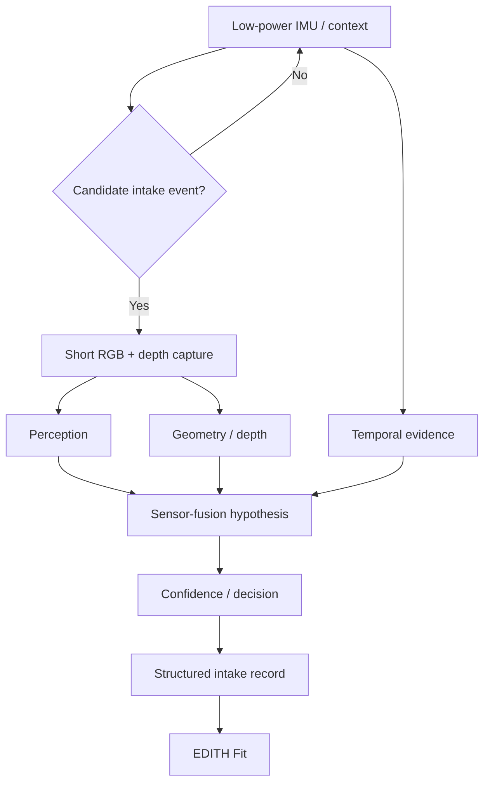

# EDITH Intake — Multimodal Sensing Research

**Computer vision · IMU · RGB · depth · inferenza temporale**

[**English**](README.md) · **Italiano**

EDITH Intake è un progetto R&D di EDITH Dev Studio che esplora il monitoraggio nutrizionale passivo tramite sensing wearable event-triggered e inferenza multimodale.

> Confine delle evidenze: questa repository contiene ricerca software realmente implementata, ma **non** presenta l'ipotesi centrale wearable/accuratezza come risultato di prodotto già validato.

## Domanda di ricerca

Può un piccolo wearable ridurre l'attrito del tracking nutrizionale combinando segnali complementari invece di dipendere da una singola immagine?

L'ipotesi di sistema combina:

- IMU/context a basso consumo per il rilevamento di eventi candidati
- acquisizione RGB event-triggered
- monocular depth e futuri vincoli ToF
- tracking temporale
- identificazione di cibo/contenitori
- decisioni confidence-aware
- inferenza sul telefono associato

## Architettura



## Cosa è stato realmente implementato

La repository privata è andata oltre la sola pianificazione architetturale.

### Software perception / identity

Lavoro implementato:

- esecuzione reale di **DINOv2 ViT-S/14**
- embedding visuali a 384 dimensioni
- reference store multi-prototipo da 72 immagini su sei classi
- statistiche di distribuzione per classe
- lavoro su open-set / unknown rejection
- identity gating multi-segnale
- esperimenti di semantic verification

### Ricerca depth / quantità

Lavoro implementato:

- provider **Depth Anything V2 Small**
- esecuzione locale del checkpoint su GPU e CPU
- ricerca sulla calibrazione della scala metrica
- infrastruttura di quantity ablation
- separazione esplicita tra fixture reference/sintetiche e ground truth fisica

Una misura locale registrata per Depth Anything V2 Small ha riportato:

- latenza warm su RTX 4060 Ti: **164,8 ms**
- latenza minima osservata su RTX 4060 Ti: **88,2 ms**
- latenza CPU: **191,7 ms**

Sono misure dell'esecuzione del modello, non dichiarazioni di latenza end-to-end del wearable.

### Fondazione software temporale / IMU

P0.6 ha implementato:

- contratti temporali dei sensori in unità SI
- estrazione sliding-window
- trasformazioni trasparenti del segnale
- baseline classica a 18 feature
- state machine a isteresi a 4 stati
- debouncing/merge degli eventi
- analisi hand-to-mouth con hard-negative
- percorso separato per il drinking
- privacy gating
- tooling per budget energetico simulato

### Fondazione per physical capture

P0.6.1 ha implementato il software necessario a raccogliere e verificare evidenze IMU fisiche:

- bridge locale per acquisizione da sensori mobile
- ingestion CSV/JSONL
- provenance SHA-256 rigorosa
- metadata espliciti per sensore/mount
- inferenza dell'unità timestamp che fallisce in modo chiuso quando ambigua
- normalizzazione in unità SI
- audit della qualità temporale
- stima di gap/drop
- rilevamento di timestamp non monotoni
- etichette esplicite per evidenza fisica vs sintetica

Nella revisione sorgente usata qui, **il software di acquisizione era pronto ma la cattura fisica live richiedeva ancora l'azione dell'operatore**.

## Perché sensing multimodale

| Segnale | Forte in | Debole in |
|---|---|---|
| IMU | rilevamento low-power di eventi candidati | identità del cibo |
| RGB | identità, segmentazione, contenitori | scala assoluta |
| monocular depth | geometria relativa densa | scala metrica assoluta |
| ToF | distanza/metrica e vincoli geometrici | identità/texture fine |
| temporal tracking | variazione served → remaining | occlusioni/cambi scena |
| barcode/OCR | identità di prodotti confezionati | pasti generici |

La domanda di ricerca non è se più sensori "suonano meglio". Ogni segnale aggiunto deve giustificare potenza, dimensioni, latenza e complessità con benefici misurati.

## Disciplina delle evidenze

Il progetto distingue esplicitamente:

- fixture sintetiche
- reference harness
- inference del modello
- misure fisiche controllate
- futura evidenza wearable sul campo

Per esempio, le stime simulate di potenza restano etichettate `SIMULATED_POWER_BUDGET`, e le metriche di quantità su reference fixture non vengono presentate come accuratezza fisica sui pasti.

## Snapshot sorgente

```text
Repository privata: Aceishere66/EDITH-Intake
Commit: ed4a563621b8d56f8604bcf5dc76197cae707e03
```

Vedi [P0 software evidence](docs/P0_SOFTWARE_EVIDENCE.md) e [current stage](docs/CURRENT_STAGE.md).

## Codice selezionato

- [TimingQualityAuditor.py](samples/TimingQualityAuditor.py) — audit timing/jitter/gap per stream sensoriali
- [TimestampUnitInference.py](samples/TimestampUnitInference.py) — estratto fail-closed per la normalizzazione dei timestamp

## Documentazione

- [System architecture](docs/ARCHITECTURE.md)
- [Sensor-fusion strategy](docs/SENSOR_FUSION.md)
- [P0 software evidence](docs/P0_SOFTWARE_EVIDENCE.md)
- [Current stage and evidence boundary](docs/CURRENT_STAGE.md)
- [Source provenance](docs/SOURCE_PROVENANCE.md)
- [Public research scope](docs/PUBLIC_SCOPE.md)

## Link

- Engineering portfolio: https://github.com/Aceishere66/engineering-portfolio
- EDITH Dev Studio engineering page: https://edithdevstudio.com/engineering/
