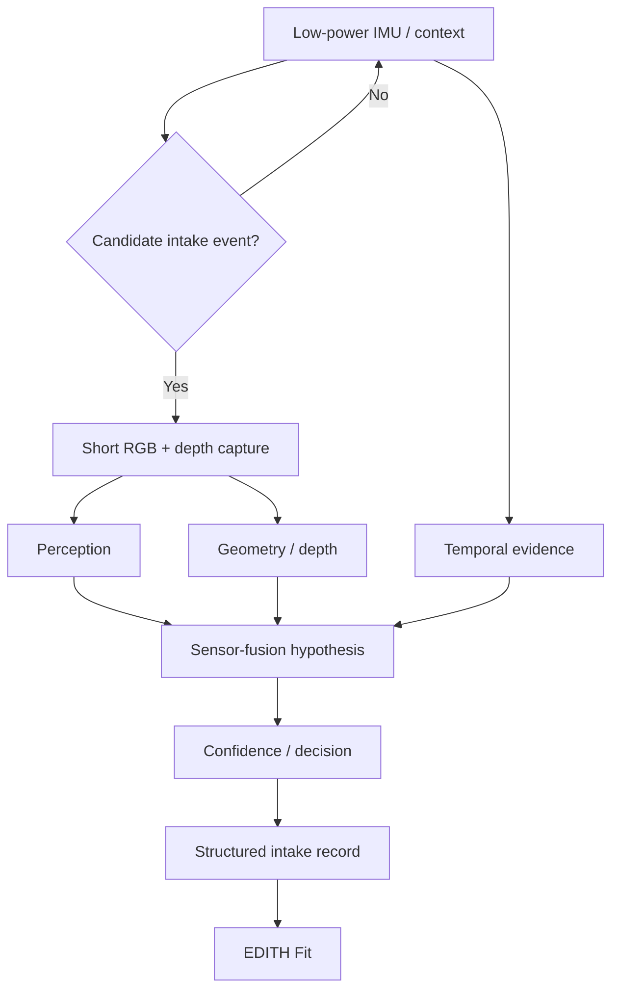

# EDITH Intake — Multimodal Sensing Research

[**English**](README.md) · [Italiano](README.it.md)

**Computer vision · IMU · RGB · depth · temporal inference**

EDITH Intake is an EDITH Dev Studio R&D project exploring passive nutrition capture through event-triggered wearable sensing and multimodal inference.

> Evidence boundary: this repository contains real implemented software research, but it does **not** present the central wearable/accuracy hypothesis as a validated product result.

## Research question

Can a small wearable reduce nutrition-logging friction by combining complementary signals rather than depending on a single image?

The system hypothesis combines:

- low-power IMU/context for candidate-event detection
- event-triggered RGB capture
- monocular depth and future ToF constraints
- temporal tracking
- food/container identity
- confidence-aware decisions
- paired-phone inference

## Architecture



## What has actually been implemented

The private source has progressed beyond architecture-only planning.

### Perception / identity software

Implemented work includes:

- real **DINOv2 ViT-S/14** execution
- 384-dimensional visual embeddings
- a 72-image multi-prototype reference store across six classes
- class-distribution statistics
- open-set / unknown rejection work
- multi-signal identity gating
- semantic verification experiments

### Depth / quantity research

Implemented work includes:

- **Depth Anything V2 Small** provider
- local checkpoint execution on GPU and CPU
- metric-scale calibration research
- quantity ablation infrastructure
- explicit separation between reference/synthetic fixtures and physical ground truth

A recorded local Depth Anything V2 Small run reported:

- RTX 4060 Ti warm latency: **164.8 ms**
- RTX 4060 Ti minimum observed latency: **88.2 ms**
- CPU latency: **191.7 ms**

These are model-execution measurements, not end-to-end wearable latency claims.

### Temporal / IMU software foundation

P0.6 implemented:

- SI-unit temporal sensor contracts
- sliding-window extraction
- transparent signal transforms
- an 18-element classical feature baseline
- a 4-state hysteresis intake state machine
- debouncing/event merging
- hand-to-mouth analysis with hard-negative cases
- a separate drinking path
- privacy gating
- simulated power-budget tooling

### Physical capture foundation

P0.6.1 implemented the software needed to collect and audit physical IMU evidence:

- local mobile sensor capture bridge
- CSV/JSONL ingestion
- strict SHA-256 provenance
- explicit sensor/mount metadata
- timestamp unit inference that fails closed when ambiguous
- SI unit normalization
- timing-quality audit
- gap/drop estimation
- non-monotonic timestamp detection
- physical-vs-synthetic evidence labels

At the source snapshot used here, the **capture software was ready but live physical capture still required operator action**.

## Why multimodal sensing

| Signal | Strong at | Weak at |
|---|---|---|
| IMU | low-power event candidate detection | food identity |
| RGB | identity, segmentation, containers | absolute scale |
| monocular depth | dense relative geometry | absolute metric scale |
| ToF | metric distance/geometry constraints | identity/fine texture |
| temporal tracking | served → remaining change | occlusion/scene changes |
| barcode/OCR | packaged-product identity | general meals |

The research question is not whether more sensors sound better. Each added signal must justify its power, size, latency and complexity with measured benefit.

## Evidence discipline

The project explicitly distinguishes:

- synthetic fixtures
- reference harnesses
- model inference
- controlled physical measurements
- future wearable field evidence

For example, simulated power estimates remain labeled `SIMULATED_POWER_BUDGET`, and reference-fixture quantity metrics are not presented as physical meal accuracy.

## Current source snapshot

```text
Private repository: Aceishere66/EDITH-Intake
Commit: ed4a563621b8d56f8604bcf5dc76197cae707e03
```

See [P0 software evidence](docs/P0_SOFTWARE_EVIDENCE.md) and [current stage](docs/CURRENT_STAGE.md).

## Selected source

- [TimingQualityAuditor.py](samples/TimingQualityAuditor.py) — timing/jitter/gap audit for sensor streams
- [TimestampUnitInference.py](samples/TimestampUnitInference.py) — fail-closed timestamp normalization excerpt

## Documentation

- [System architecture](docs/ARCHITECTURE.md)
- [Sensor-fusion strategy](docs/SENSOR_FUSION.md)
- [P0 software evidence](docs/P0_SOFTWARE_EVIDENCE.md)
- [Current stage and evidence boundary](docs/CURRENT_STAGE.md)
- [Source provenance](docs/SOURCE_PROVENANCE.md)
- [Public research scope](docs/PUBLIC_SCOPE.md)

## Links

- Engineering portfolio: https://github.com/Aceishere66/engineering-portfolio
- EDITH Dev Studio engineering page: https://edithdevstudio.com/engineering/
